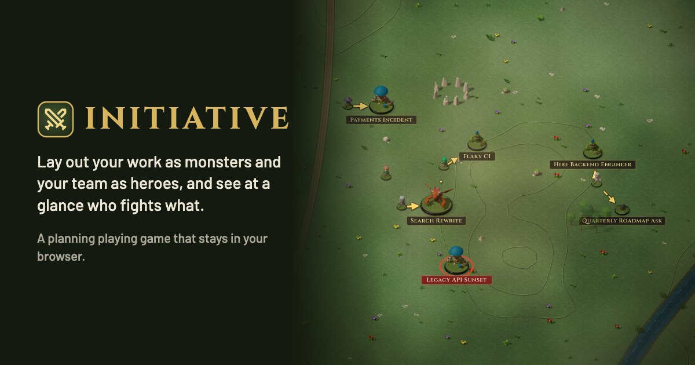

# Initiative

*A planning playing game.*

[](https://github.com/WojtekTheWebDev/initiative/actions/workflows/ci.yml)
[](LICENSE)

**[Play it in your browser](https://initiative-ppg.vercel.app)**: no sign-up, nothing to install.



A personal progress tracker shaped like a tabletop RPG battlefield. Work items are **monsters** (bigger scope means a bigger base, and you pick the creature) and the people dealing with them are **heroes**. You plan by dragging heroes onto monsters on an infinite map. Monsters nobody is fighting pulse red, so gaps are easy to spot.

It is for one user and keeps everything in your browser. It is a static page, so it runs on your machine or on any static host such as Vercel. Save files are plain YAML that you or an agent can edit by hand. The full spec is in [`docs/DESIGN.md`](docs/DESIGN.md).

## Privacy

Your table never leaves your browser: there is no backend, account or sync. The hosted site counts page views with [Vercel Web Analytics](https://vercel.com/docs/analytics) (the page visited and the kind of browser, without cookies), and never anything from the table.

## Getting started

```bash
npm install
npm run dev
```

Open [http://localhost:3000](http://localhost:3000).

| Script | What it does |
| ------ | ------------ |
| `npm run dev` | Dev server on port 3000 |
| `npm run build` then `npm start` | Production build and server |
| `npm test` | Vitest unit tests (`npm run test:watch` to watch) |
| `npm run lint` | ESLint |
| `npm run make:felt` | Regenerates the felt textures in `public/terrain/` (the output is committed) |
| `npm run bake:minis` | Re-render the miniature images in `public/minis/` (see [Minis](#minis)) |
| `npm run bake:terrain` | Re-render the terrain art in `public/terrain/` (see [Terrain](#terrain)) |

## How to use

- **Move around:** the wheel (or a trackpad pinch) zooms at the cursor. Drag empty ground to pan.
- **Cards:** click a monster or hero to open its card beside it: a monster's notes and fighters with **Slay**, a hero's targets (click one to fly there), and **Delete** in the **...** menu. Esc or a click on empty ground closes it.
- **Monsters:** drag one to move it.
- **Heroes:** drag a hero onto a monster to add it to the hero's targets: the first becomes the main target, later ones are secondary, and the hero stays closest to its main target. Every hero has an arrow to each of its targets: solid for the main target, dashed for secondary ones; click an arrow to make it main or remove it. An engaged hero dropped on empty ground keeps its targets and moves to that side of them; an idle one stands where it is let go.
- **Arrows:** click an arrow for **Make main** or **Remove target**. Selecting a hero or monster highlights its arrows.
- **Unfought monsters** pulse red. The red counter under the wordmark lists them, and red arrows at the edge of the view point to the ones off-screen. Click either to fly there.
- **Slay** a monster by dropping it on the trophy shelf in the bottom-left corner, or with **Slay** on its card. Heroes fighting it move on to their next target, or stand idle where it was. The toast offers **Undo** for 8 seconds. Click the shelf to open the trophy hall, with a plaque for every slain monster and who fought it; **Revive** on a plaque brings the monster back. **Delete** does the same cleanup but removes the monster for good, so it asks you to click twice.
- **+ Monster** and **+ Hero** in the top-right corner open the summon and recruit dialogs; **Edit** on a card opens the same dialog filled in.
- **Game menu:** click the **Initiative** wordmark for **Save game to file** (`⌘S`), **Load game from file** (`⌘O`) and **New game**. You can also drop a save file anywhere on the window to load it. Loading shows what is on your table beside what is in the file, and nothing changes until you click **Replace table**.
- **Map controls** in the bottom-right corner zoom and fit everything; **?** lists the keyboard shortcuts (`N`, `H`, `F`, `+`, `-`).
- **Keyboard:** Tab reaches every control, figure and arrow, Enter opens it and Esc closes it.

## Data

- Your table lives in the browser's local storage, separately for each browser and site address. Every change is stored as you make it.
- The browser copy has no history and can be cleared with the site data, so **Save game to file** now and then. After a week of unsaved changes, an amber dot on the wordmark reminds you.
- A save file is one YAML file, `initiative-<date>.yaml`. You can edit it by hand and load it back with **Load game**. Save files hold real names and people topics: keep them out of git (`/data/` and `initiative-*.yaml` are gitignored for that).
- A first visit opens a short tutorial on an empty table: summon a monster, recruit a hero, assign the hero and slay the monster. Skipping it deals the example table, `data.example/initiative.yaml`. **Play the tutorial** in the menu runs it again, and **New game** starts over with an empty table or the example.
- The format is described in [`docs/DESIGN.md`](docs/DESIGN.md#data-model). Anything that can be worked out (who fights what, the mini of a monster that has no pick) is not stored.

## Minis

Every figure is a painted miniature: a 3D model rendered once into an image, so the browser only draws pictures. The models live in `assets/minis/` (sources and licences in [`assets/minis/LICENSES.md`](assets/minis/LICENSES.md)), and the baked images and `manifest.json` in `public/minis/` are committed.

To add a model:

1. Put the model in `assets/minis/` as `<id>.glb`, named after what it shows (e.g. `paladin.glb`). Use a CC0 or otherwise free model and add it to `LICENSES.md`. If it is rigged, keep only the clip you want it posed in to keep the file small.
2. Add a sidecar `<id>.json` next to it:
   ```json
   { "name": "Paladin", "kind": "hero" }
   ```
   A monster mini is `{ "name": "Mimic", "kind": "monster" }`; it can stand on a base of any size. Optional keys: `pose` (`{ "clip": "Idle", "time": 0.5 }`), `height` (in base radii, default 2.2), `footprint`, `rotate` (degrees), `hide` (node names), `colors` (material name to colour) and `primer` (one flat colour). They are described in `scripts/bake-minis.ts`.
3. Run `npm run bake:minis` and commit the changed files in `public/minis/`. A new hero mini shows up in the hero form's picker, and a new monster mini in the monster form's bestiary.

The bake renders with three.js in headless Chromium (installed by the script through Playwright on first run), with a fixed camera and lights, so rerunning it gives the same files. `npm run bake:minis -- knight` rebakes only some ids.

## Terrain

The scatter, raised pieces and bridges on the table are baked the same way, from CC0 models in `assets/terrain/models/` (sources and licences in [`assets/terrain/LICENSES.md`](assets/terrain/LICENSES.md)). Each piece of art is a sidecar named after its art key, e.g. `assets/terrain/camp-0.json`, that puts it together from those models:

```json
{
  "name": "Camp",
  "kind": "terrain",
  "radius": 60,
  "parts": [
    { "model": "tent_detailedOpen", "x": -0.45, "z": -0.35, "scale": 1.4, "rotate": 20 },
    { "model": "bonfire", "x": 0.6, "z": 0.3, "scale": 0.2 }
  ]
}
```

`radius` is world units per model unit, `x` and `z` place a part (x to the right, z toward the viewer) around the piece's footprint centre, and a part can also take `y`, `rotate`, `scale` and `colors`. The whole piece can be turned with `rotate` (degrees around the vertical axis) or `along` (the angle its x axis should show at on screen, clockwise from the right); the stone bridges `bridge-0` to `bridge-11` use `along` to lie at every 15 degrees. `assets/terrain/colors.json` holds the material colours shared by every piece. Run `npm run bake:terrain` (or `npm run bake:terrain -- camp-0` for some keys) and commit the changed files in `public/terrain/`. If a raised piece grows, raise its kind's `PIECE_SIZE` in `lib/map/terrain.ts`; `npm test` fails when a baked piece outgrows it.

## Deploy your own

It is a static Next.js page, so any host that runs `npm run build` works. On Vercel, import the repository and deploy with the defaults. Set `NEXT_PUBLIC_SITE_URL` to your address so the canonical link and link previews point at it, and change the address in `app/robots.txt` and `app/sitemap.xml`. Page views are counted only if you turn on Web Analytics for the project.

## Stack

Next.js 16 (App Router, a static page), React 19, Tailwind 4, the `yaml` package for save files, and Vitest. The minis are baked with three.js and Playwright (dev only).

## Contributing

Issues and pull requests are welcome: see [`CONTRIBUTING.md`](CONTRIBUTING.md). Please never attach a real save file; use the example table or made-up names.

## Licence

The code is [MIT](LICENSE) licensed. The 3D models are CC0, by [Kay Lousberg (KayKit)](https://kaylousberg.itch.io/kaykit-adventurers), [Quaternius](https://quaternius.com) and [Kenney](https://kenney.nl); see [`assets/minis/LICENSES.md`](assets/minis/LICENSES.md) and [`assets/terrain/LICENSES.md`](assets/terrain/LICENSES.md). The fonts, Cinzel and Barlow, come from Google Fonts under the SIL Open Font License.
